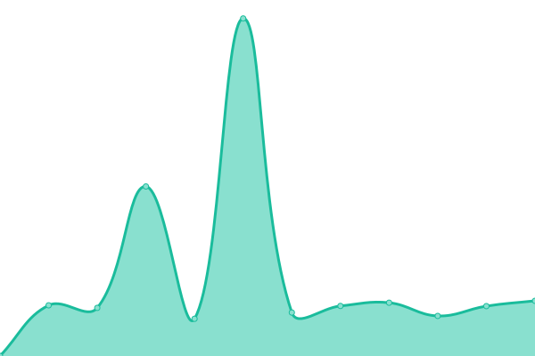

# [📈 Live Status](https://demo.upptime.js.org): <!--live status--> **🟧 Partial outage**

This repository contains the open-source uptime monitor and status page for [Angga Priyatna](anggaprytn.com), powered by [Upptime](https://github.com/upptime/upptime).

With [Upptime](https://upptime.js.org), you can get your own unlimited and free uptime monitor and status page, powered entirely by a GitHub repository. We use [Issues](https://github.com/anggaprytn/service-uptime/issues) as incident reports, [Actions](https://github.com/anggaprytn/service-uptime/actions) as uptime monitors, and [Pages](https://demo.upptime.js.org) for the status page.

<!--start: status pages-->
<!-- This summary is generated by Upptime (https://github.com/upptime/upptime) -->
<!-- Do not edit this manually, your changes will be overwritten -->
<!-- prettier-ignore -->
| URL | Status | History | Response Time | Uptime |
| --- | ------ | ------- | ------------- | ------ |
|  [Fleet Web](https://fleet.bgn.go.id/fe/login) | 🟩 Up | [fleet-web.yml](https://github.com/anggaprytn/service-uptime/commits/HEAD/history/fleet-web.yml) | 

 1884ms
     
 | 

<a href="https://anggaprytn.github.io/service-uptime/history/fleet-web">99.92%</a>
    

|  [SmartPatrol](https://smartpatrol-dev.cudo.co.id/) | 🟩 Up | [smart-patrol.yml](https://github.com/anggaprytn/service-uptime/commits/HEAD/history/smart-patrol.yml) | 

 1219ms
     
 | 

<a href="https://anggaprytn.github.io/service-uptime/history/smart-patrol">100.00%</a>
    

|  [Anggaprytn](https://anggaprytn.com) | 🟥 Down | [anggaprytn.yml](https://github.com/anggaprytn/service-uptime/commits/HEAD/history/anggaprytn.yml) | 

 0ms
     
 | 

<a href="https://anggaprytn.github.io/service-uptime/history/anggaprytn">0.00%</a>
    

|  [CodePush Cudo](https://codepush.cudo.co.id/) | 🟩 Up | [code-push-cudo.yml](https://github.com/anggaprytn/service-uptime/commits/HEAD/history/code-push-cudo.yml) | 

 2541ms
     
 | 

<a href="https://anggaprytn.github.io/service-uptime/history/code-push-cudo">99.25%</a>
    

|  [Logging Cudo](https://logging.cudo.co.id/login) | 🟩 Up | [logging-cudo.yml](https://github.com/anggaprytn/service-uptime/commits/HEAD/history/logging-cudo.yml) | 

 1308ms
     
 | 

<a href="https://anggaprytn.github.io/service-uptime/history/logging-cudo">99.51%</a>
    

<!--end: status pages-->

[**Visit our status website →**](https://demo.upptime.js.org)

## 📄 License

- Powered by: [Upptime](https://github.com/upptime/upptime)
- Code: [MIT](./LICENSE) © [Anand Chowdhary](https://anandchowdhary.com), supported by [Pabio](https://pabio.com)
- Data in the `./history` directory: [Open Database License](https://opendatacommons.org/licenses/odbl/1-0/)
